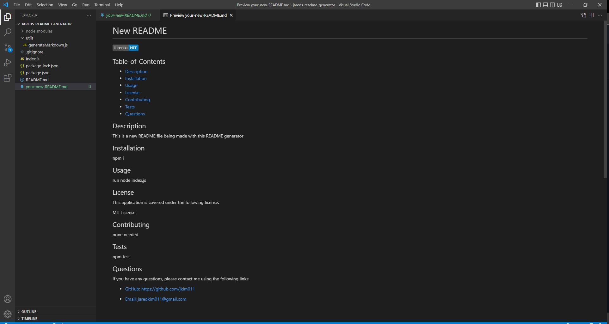

# README Generator

    

  ## Table-of-Contents
  * [Description](#description)
  * [Installation](#installation)
  * [Usage](#usage)
  * [License](#license)
  * [Contributing](#contributing)
  * [Tests](#tests)
  * [Questions](#questions)
  
  ## Description
  This application was made with the intent to help users easily and efficiently make a high quality README file for their projects. The README file is a very important part to everyone's GitHub repository because it informs the users of what the application is and how to use it. This was made using JavaScript and is run through the command line using node. 

  ## Installation
  1. Fork this repository 
  2. In the VS code command line run the following:  
      npm init -y
  3. Download inquirer by using the following:  
      npm i inquirer@8.2.4

  ## Usage
  **Click below for demonstration video:**  
  [readme-generator-video.webm](https://user-images.githubusercontent.com/112585959/202081360-5a2621aa-f1bf-4fb7-89e1-d37b151fc94d.webm)  
  
  **Image of newly generated README:**  
    
  
  In the VS code command line under the index.js file, run the following:  
      node index.js 
  
  ## License 
  This application is covered under the following license:

  MIT License

  ## Contributing
  No contribution is necessary for this project.

  ## Tests
  Run the application through the terminal and answer the questions that come up.

  ## Questions
  If you have any questions, please contact me using the following links:

  - [GitHub: https://github.com/jkim011](https://github.com/jkim011)

  - [Email: jaredkim011@gmail.com](mailto:jaredkim011@gmail.com)
